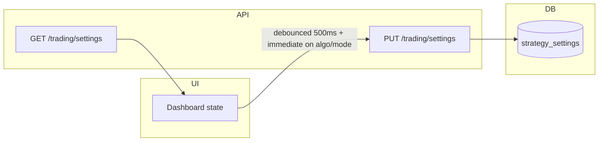
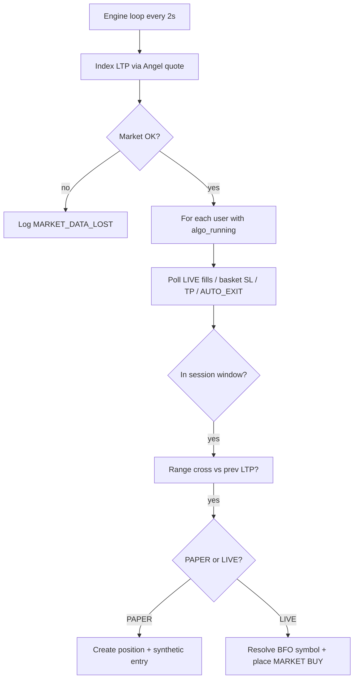

# Trading execution layer

This document describes the backend trading engine, persistence, LIVE Angel One integration, and how the dashboard syncs settings.

## File changes (summary)

| Area | Files |
|------|--------|
| Models | `backend/app/models.py` — `StrategySettings`, `TradePosition`, `TradingLog` |
| Config | `backend/app/config.py` — `ANGEL_BFO_*`, `default_sensex_option_lot_size` |
| Services | `backend/app/services/trading_repository.py`, `trading_engine.py`, `market_ltp.py`, `bfo_options.py`, `angel_orders.py` |
| API | `backend/app/routers/trading.py`, `backend/app/schemas.py` |
| App | `backend/app/main.py` — router + async engine task in lifespan |
| Angel | `backend/app/routers/angel.py` — clears `market_ltp` cache on JWT refresh |
| UI (append-only) | `src/components/DashboardHome.tsx` — persist, mode, tables, Close |

## Database schema

### `strategy_settings`

| Column | Type | Notes |
|--------|------|--------|
| `user_id` | PK, FK → `users.id` | One row per user |
| `config_json` | TEXT | Full dashboard JSON (times, gaps, legs, SL, exit mode, `exchangeLotSize`) |
| `algo_running` | BOOLEAN | Mirrors dashboard “Algo on” |
| `trading_mode` | VARCHAR | `PAPER` or `LIVE` (default `PAPER`) |
| `updated_at` | DATETIME | Auto |

### `trade_positions`

Open (`status=OPEN`) or closed (`CLOSED`). Key fields: `leg_id` (`P1`…`C2`), `range_level`, `strike`, `tp`, `lots`, `quantity`, `put_sl_pts`, `call_sl_pts`, `sl_mode`, `underlying_at_entry`, `entry_price`, exits, `pnl`, `exit_reason`, Angel fields (`order_id`, `unique_order_id`, `trading_symbol`, `symbol_token`, `exchange`).

**Leg re-entry:** `config.legEntryMode` defaults to `once` (any open/closed row for that leg since IST midnight blocks a new entry). With `multi`, a leg may open again after a **manual** close the same day.

**Same-day block after TP / basket SL / session exit:** If a leg was **closed** today with `exit_reason` in `TP_HIT`, `PUT_SL_HIT`, `CALL_SL_HIT`, `AUTO_EXIT`, or legacy `END_TIME`, that leg **cannot** open again until the next IST calendar day — even when `legEntryMode` is `multi` (prevents ENTRY → TP_HIT loops in paper tests).

### Dashboard calculated trades (UI)

The P1…C3 grid uses **only** the start-bar **close** at your start time — **not** live LTP. If close is unavailable, the grid stays empty until **Refresh** on the start-bar panel returns a valid close; then levels are recomputed and saved with the rest of the config.

### `trading_logs`

Append-only audit: `mode`, `leg`, `action`, optional numeric columns, `order_id`, `message`.

## Persistence flow

On startup the FastAPI lifespan runs `ensure_schema()` (creates missing tables). After a backend restart, `GET /trading/settings` restores `config_json`, `algo_running`, and `trading_mode`. Open positions and logs are read from `trade_positions` / `trading_logs`.

## Trading flow (high level)

## Paper trading flow

- No `placeOrder` calls.
- On range cross: synthetic option entry price from strategy `offset`; `underlying_at_entry` = index LTP; P&L mark uses a simple delta proxy vs index (`±0.35` per index point move).
- Exits: **TP** — index hits take-profit (`PUT`: index ≤ TP below range; `CALL`: index ≥ TP above range). TP is computed as **range − gap** (PUT) or **range + gap** (CALL), same as the dashboard grid.
- **Basket index SL** — `putSL` / `callSL` in config are **absolute index levels** (must be ≥ ~15000 so small “points” values are ignored). When index ≥ `putSL`, **all** open PUT legs close with `PUT_SL_HIT`. When index ≤ `callSL`, **all** open CALL legs close with `CALL_SL_HIT`.
- **`AUTO_EXIT`** — at `endTime` (IST) with `slMode=auto`, any remaining open legs are closed.
- **`MANUAL_CLOSE`** via `POST /trading/legs/{id}/close`.
- **Session window for new entries:** `LIVE` only between `startTime` and `endTime` (IST). **`PAPER` ignores that window** so you can test range logic anytime; TP/SL / end-time exits still use your configured times.

## LIVE trading flow

1. **Instrument map** — `ANGEL_BFO_INSTRUMENTS_JSON` (see `.env.example`). Each row: `strike`, `side` (`PE`/`CE`), `token`, `tradingsymbol`, `lotsize`. Nearest strike to the leg’s option strike is chosen.
2. **Quantity** — `user_lots × lotsize` from the resolved row (overrides generic `exchangeLotSize` for LIVE).
3. **Order** — `POST` Angel `placeOrder`: `MARKET`, `CARRYFORWARD` (NRML), exchange from `ANGEL_OPTION_EXCHANGE` (default `BFO`), `BUY` for long option.
4. **Fill** — Order book polled until `complete` / `rejected` / `cancelled`; `entry_price` set from `averageprice` when filled.
5. **PnL while open** — Same synthetic mark as paper until you add option-token quotes (optional future).

## Order lifecycle

1. **Placed** — Row inserted with `entry_price=0`, `order_id` set, logs `ORDER_PLACED` / `LEVEL_TRIGGERED`.
2. **Tracked** — `get_order_book` each tick until terminal state.
3. **Filled** — `entry_price` updated; log `ORDER_FILLED`.
4. **Rejected / cancelled** — Position closed with zero P&L; logs `ORDER_REJECTED` / `ORDER_CANCELLED`.
5. **REST** — `POST /trading/order/cancel`, `POST /trading/order/modify`, `GET /trading/order/status` for operator tools.

## Log table structure (`trading_logs`)

| Column | Purpose |
|--------|---------|
| `created_at` | UTC timestamp |
| `mode` | `PAPER` / `LIVE` |
| `leg` | `P1`, `C2`, or `-` for global |
| `action` | e.g. `ALGO_STARTED`, `MARKET_DATA_CONNECTED`, `LEVEL_TRIGGERED`, `ENTRY`, `TP_HIT`, `PUT_SL_HIT`, `CALL_SL_HIT`, `AUTO_EXIT`, `MANUAL_CLOSE`, `ORDER_*` |
| `symbol`, `strike`, `quantity`, `entry_price`, `exit_price`, `pnl`, `status`, `order_id`, `message` | Optional detail |

## Trade lifecycle (leg)

1. **Idle** — No `OPEN` row for `leg_id`.
2. **Trigger** — Index path crosses `range` between ticks (`prev_ltp` vs `ltp`).
3. **Enter** — `OPEN` row created (PAPER immediately priced; LIVE after broker fill).
4. **Manage** — TP/SL on index rules; LIVE fill polling.
5. **Exit** — Row `CLOSED` with `exit_reason` (`TP_HIT`, `PUT_SL_HIT`, `CALL_SL_HIT`, `AUTO_EXIT`, `MANUAL_CLOSE`, `ORDER_*`, …) and `pnl`. Trading log `action` matches `exit_reason` for exits.

## Environment

- `ANGEL_BFO_INSTRUMENTS_JSON` — required for LIVE option orders (see `backend/.env.example`).
- `DEFAULT_SENSEX_OPTION_LOT_SIZE` — default multiplier for paper / sizing when not overridden in config (`exchangeLotSize`).

Restart the API once so `Base.metadata.create_all` creates new tables on existing SQLite files.
