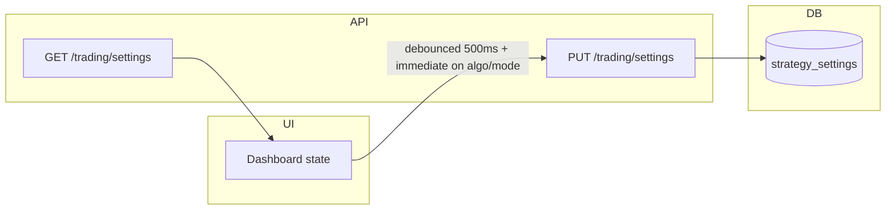
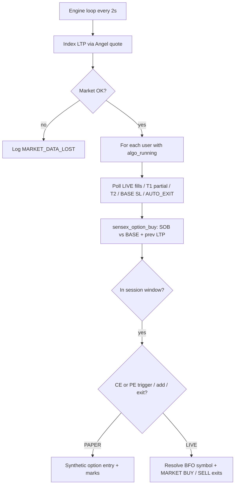

# Trading execution layer

This document describes the backend trading engine, persistence, LIVE Angel One integration, and how the dashboard syncs settings.

## File changes (summary)

| Area | Files |
|------|--------|
| Models | `backend/app/models.py` — `StrategySettings`, `TradePosition`, `TradingLog` |
| Config | `backend/app/config.py` — `ANGEL_BFO_*`, `default_sensex_option_lot_size` |
| Services | `backend/app/services/trading_repository.py`, `trading_engine.py`, `sensex_option_buy.py`, `market_ltp.py`, `bfo_options.py`, `angel_orders.py` |
| API | `backend/app/routers/trading.py`, `backend/app/schemas.py` |
| App | `backend/app/main.py` — router + async engine task in lifespan |
| Angel | `backend/app/routers/angel.py` — clears `market_ltp` cache on JWT refresh |
| UI (append-only) | `src/components/DashboardHome.tsx` — persist, mode, tables, Close |

## Database schema

### `strategy_settings`

| Column | Type | Notes |
|--------|------|--------|
| `user_id` | PK, FK → `users.id` | One row per user |
| `config_json` | TEXT | Dashboard JSON: `startTime`, `endTime`, `referenceClose` (BASE), `partialClosePercent`, `slMode`, `exchangeLotSize`, `legEntryMode`, plus fixed sensex fields for the engine |
| `algo_running` | BOOLEAN | Mirrors dashboard “Algo on” |
| `trading_mode` | VARCHAR | `PAPER` or `LIVE` (default `PAPER`) |
| `updated_at` | DATETIME | Auto |

### `trade_positions`

Open (`status=OPEN`) or closed (`CLOSED`). The strategy uses **`leg_id` = `SOB`**. Legacy rows may show older leg ids. Key fields include `range_level` (BASE), `strike` (first index trigger), `tp` (T2 index), `put_sl_pts` (T1 index for SOB), `lots`, `quantity`, Angel fields when LIVE.

**Leg re-entry:** `config.legEntryMode` defaults to `once` (any open/closed row for **`SOB`** since IST midnight blocks a new entry). With `multi`, **`SOB`** may open again after a **manual** close the same day.

**Same-day block after TP / BASE stop / session exit:** If **`SOB`** was **closed** today with `exit_reason` in `TP_HIT`, `SENSEX_BASE_SL`, `AUTO_EXIT`, legacy basket reasons (`PUT_SL_HIT`, `CALL_SL_HIT`), or `END_TIME`, that leg **cannot** open again until the next IST calendar day — even when `legEntryMode` is `multi`.

### Dashboard strategy table

The **Strategy levels table** uses **BASE_PRICE** = start-bar 1m candle close at `startTime` (persisted as `referenceClose`). Fixed index math (200 / 50 / 80 / 150) matches `sensex_option_buy.py`. Updates when the start-bar close updates.

### `trading_logs`

Append-only audit: `mode`, `leg`, `action`, optional numeric columns, `order_id`, `message`.

## Persistence flow

On startup the FastAPI lifespan runs `ensure_schema()` (creates missing tables). After a backend restart, `GET /trading/settings` restores `config_json`, `algo_running`, and `trading_mode`. Open positions and logs are read from `trade_positions` / `trading_logs`.

## Trading flow (high level)

## Paper trading flow

- No `placeOrder` calls.
- **BASE** = `referenceClose` (start-bar 1m close). **CE** when index crosses **BASE + gap** (default 200); **PE** when index crosses **BASE − gap**. Adds at **−offset / +offset** steps from the first trigger (default 50), up to **`tradeCount`** lots (default 3). **No** add level at **BASE ± offset** (capped in engine).
- **Stop** — index touches **BASE** → full exit, `exit_reason` **`SENSEX_BASE_SL`**.
- **Targets** — T1 / T2 are index levels at first trigger **± target1Points / ± target2Points** (defaults 80 / 150). T1 may reduce lots by `partialClosePercent` (paper). T2 closes remainder.
- **`AUTO_EXIT`** — at `endTime` (IST) with `slMode=auto`, any open **`SOB`** is closed.
- **`MANUAL_CLOSE`** via `POST /trading/legs/SOB/close`.
- **Session window for new entries:** `LIVE` only between `startTime` and `endTime` (IST). **`PAPER` ignores that window** for new entries; exits still respect session / BASE / targets.

## LIVE trading flow

1. **Instrument map** — `ANGEL_BFO_INSTRUMENTS_JSON` (see `.env.example`). Each row: `strike`, `side` (`PE`/`CE`), `token`, `tradingsymbol`, `lotsize`. Nearest strike to the configured option strike is chosen.
2. **Quantity** — `user_lots × lotsize` from the resolved row (overrides generic `exchangeLotSize` for LIVE).
3. **Order** — `POST` Angel `placeOrder`: `MARKET`, `CARRYFORWARD` (NRML), exchange from `ANGEL_OPTION_EXCHANGE` (default `BFO`), `BUY` for long option; exits use `SELL` as implemented.
4. **Fill** — Order book polled until `complete` / `rejected` / `cancelled`; `entry_price` updated from `averageprice` when filled.
5. **PnL while open** — Synthetic option mark from index move vs entry (`±0.35` per index point) until option-token quotes are added (optional future).
6. **T1 partial** — In LIVE, T1 partial may be skipped so broker fills stay aligned with DB; T2 and BASE stop still apply (see `sensex_option_buy.py`).

## Order lifecycle

1. **Placed** — Row inserted with `entry_price=0`, `order_id` set, logs `ORDER_PLACED` / `LEVEL_TRIGGERED`.
2. **Tracked** — `get_order_book` each tick until terminal state.
3. **Filled** — `entry_price` updated; log `ORDER_FILLED`.
4. **Rejected / cancelled** — Position closed with zero P&L; logs `ORDER_REJECTED` / `ORDER_CANCELLED`.
5. **REST** — `POST /trading/order/cancel`, `POST /trading/order/modify`, `GET /trading/order/status` for operator tools.

## Log table structure (`trading_logs`)

| Column | Purpose |
|--------|---------|
| `created_at` | UTC timestamp |
| `mode` | `PAPER` / `LIVE` |
| `leg` | **`SOB`** (SENSEX option buy), or `-` for global |
| `action` | e.g. `ALGO_STARTED`, `MARKET_DATA_CONNECTED`, `LEVEL_TRIGGERED`, `ENTRY`, `TP_HIT`, `SENSEX_BASE_SL`, `AUTO_EXIT`, `MANUAL_CLOSE`, legacy `PUT_SL_HIT` / `CALL_SL_HIT`, `ORDER_*` |
| `symbol`, `strike`, `quantity`, `entry_price`, `exit_price`, `pnl`, `status`, `order_id`, `message` | Optional detail |

## SENSEX option buy (only strategy)

The background engine always runs **`sensex_option_buy.py`** per user when `algo_running` is true. There is no multi-leg range grid.

| Input (dashboard / `config_json`) | Role |
|-----------------------------------|------|
| `referenceClose` | **BASE** — persisted from start-bar 1m close at `startTime`. |
| `gap` | Index points above BASE for CE entry / below BASE for PE entry (default **200**). |
| `offset` | Add-lot step: CE adds lower; PE adds higher (default **50**). Capped so there is **no** add at `BASE ± offset`. |
| `tradeCount` | Max lots per direction (default **3**: entry + two adds). |
| `target1Points`, `target2Points` | T1/T2 from **first** index trigger (defaults **80** / **150**). |
| `partialClosePercent` | At T1 (paper), fraction of lots reduced; remainder at T2 or BASE. **LIVE:** T1 partial may be skipped — see code. |
| `slMode` | `auto` closes open **`SOB`** at session `endTime`; manual still allows operator close. |
| `exchangeLotSize`, `legEntryMode` | Lot multiplier and same-day re-entry behaviour for **`SOB`**. |

At most one open **`SOB`** row (side **CALL** or **PUT**). Session end **`AUTO_EXIT`** and index return to **BASE** close the leg with **`SENSEX_BASE_SL`** (session-blocking for the rest of the IST day).

## Trade lifecycle — leg `SOB`

1. **Idle** — No `OPEN` row for `SOB`, no session-blocking exit today (unless noted above).
2. **First trigger** — Index crosses CE entry (**BASE + gap**) or PE entry (**BASE − gap**) between `prev_ltp` and current LTP → first lot, side set.
3. **Adds** — Further crosses of add levels (spaced by `offset`) up to `tradeCount` lots.
4. **Manage** — Poll LIVE orders; monitor T1 / T2 / BASE on index; optional T1 partial (paper).
5. **Exit** — Row `CLOSED` with `exit_reason` (`TP_HIT`, `SENSEX_BASE_SL`, `AUTO_EXIT`, `MANUAL_CLOSE`, `ORDER_*`, …) and `pnl`; trading log `action` aligns with the exit.

## Environment

- `ANGEL_BFO_INSTRUMENTS_JSON` — required for LIVE option orders (see `backend/.env.example`).
- `DEFAULT_SENSEX_OPTION_LOT_SIZE` — default multiplier for paper / sizing when not overridden in config (`exchangeLotSize`).

Restart the API once so `Base.metadata.create_all` creates new tables on existing SQLite files.
