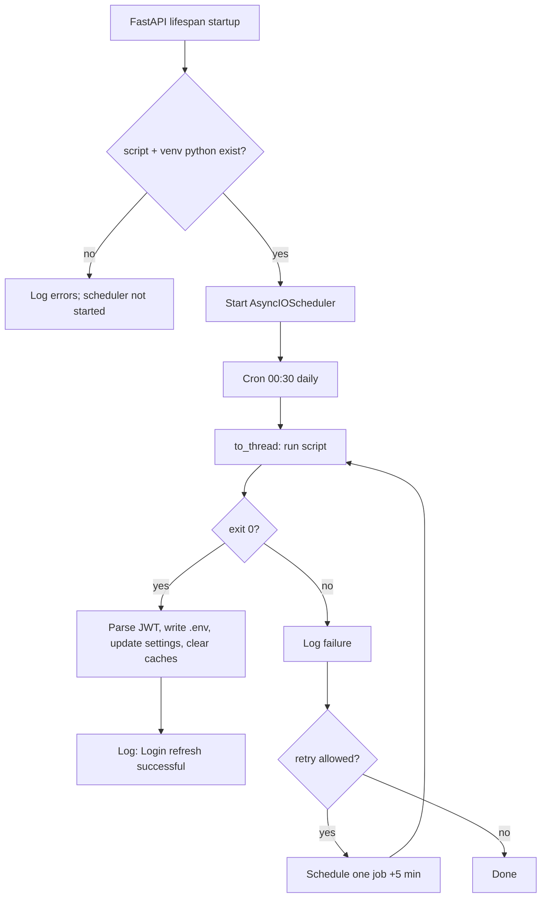

# Angel One automatic JWT refresh

## Behaviour

1. On FastAPI startup, the backend resolves (from the `backend/` root, never hardcoded drive paths):
   - `scripts/angel_smartapi_login.py`
   - `.venv/Scripts/python.exe` (Windows) or `.venv/bin/python` (Unix)
2. If both exist, **APScheduler** starts with a **single** daily job at **00:30** (server local time).
3. The job runs the login script in a **thread pool** (does not block the event loop). **Stdout/stderr** are logged (JWT values masked in logs).
4. On **exit 0**, the service parses `ANGEL_JWT_TOKEN=...` from stdout, updates `backend/.env`, updates in-memory `settings.angel_jwt_token`, and clears Angel quote caches.
5. On failure, the backend **does not crash**. A **one-time retry** is scheduled **5 minutes** later (no further automatic retries until the next 00:30 run).
6. **Manual refresh:** `POST /angel/refresh-session` (Bearer JWT, **admin** only) runs the same pipeline once (no automatic 5-minute retry on manual failure).

## Scheduler flow

## Log messages (examples)

| When | Message |
|------|---------|
| Paths OK at startup | `[Scheduler] Angel login script and venv Python verified.` |
| Paths missing | `[Scheduler] Startup verification failed: …` |
| Scheduler started | `[Scheduler] Angel One auto-login scheduled for 00:30 daily` |
| Job begins | `[Scheduler] Running Angel One login refresh... (cron_00_30)` |
| Script stdout | `[Scheduler] angel_smartapi_login.py stdout:` + masked body |
| Script stderr | `[Scheduler] angel_smartapi_login.py stderr:` + masked body |
| Script exit 0 | `[Scheduler] angel_smartapi_login.py completed (exit 0)` |
| JWT applied | `[Scheduler] Login refresh successful` |
| | `[Scheduler] ANGEL_JWT_TOKEN written to .env; in-memory JWT length=<n>` |
| Script non-zero | `[Scheduler] Login refresh failed: exit_code=<n>` |
| Exception / timeout | `[Scheduler] Login refresh failed: <error>` |
| Retry scheduled | `[Scheduler] Scheduling single retry in 5 minutes...` |
| Retry registered | `[Scheduler] Retry job registered at <iso-timestamp>` |
| Shutdown | `[Scheduler] Angel auto-login scheduler stopped` |

## Dependencies

- `APScheduler>=3.10.4` in `backend/requirements.txt`
